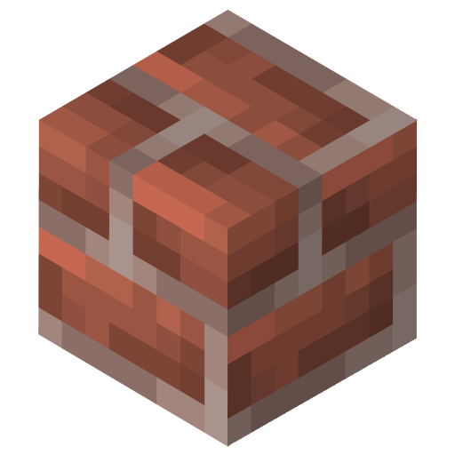

<h1 align="center">Hermes Launcher</h1>

<em><h5 align="center">(powered by [Helios](https://github.com/dscalzi/))</h5></em>

[
](https://github.com/dscalzi/HeliosLauncher/actions)  

Rejoingnez DEMOCRAFT ou n'importe quel serveur Minecraft sans à vous soucier des mods et de ce démon que l'on nomme java eclipse.

## Features

* 🔒 Full account management.
  * Add multiple accounts and easily switch between them.
  * Microsoft (OAuth 2.0) + Mojang (Yggdrasil) authentication fully supported.
  * Credentials are never stored and transmitted directly to Mojang.
* 📂 Efficient asset management.
  * Receive client updates as soon as we release them.
  * Files are validated before launch. Corrupt or incorrect files will be redownloaded.
* ☕ **Automatic Java validation.**
  * If you have an incompatible version of Java installed, we'll install the right one *for you*.
  * You do not need to have Java installed to run the launcher.
* 📰 News feed natively built into the launcher.
* ⚙️ Intuitive settings management, including a Java control panel.
* Supports all of our servers.
  * Switch between server configurations with ease.
  * View the player count of the selected server.
* Automatic updates. That's right, the launcher updates itself.
*  View the status of Mojang's services.

This is not an exhaustive list. Download and install the launcher to gauge all it can do!

#### Need Help? [Check the wiki.][wiki]

#### Like the project? Leave a ⭐ star on the repository!

## Downloads

You can download from [GitHub Releases](https://github.com/Funasitien/HermesLauncher/releases)

#### Latest Release

#### Latest Pre-Release

**Supported Platforms**

If you download from the [Releases](https://github.com/Funasitien/HermesLauncher/releases) tab, select the installer for your system.

| Platform | File |
| -------- | ---- |
| Windows x64 | `Hermes-Launcher-setup-VERSION.exe` |
| macOS x64 | `Hermes-Launcher-setup-VERSION-x64.dmg` |
| macOS arm64 | `Hermes-Launcher-setup-VERSION-arm64.dmg` |
| Linux x64 | `Hermes-Launcher-setup-VERSION.AppImage` |

---

## Resources

* [Wiki][wiki]
* [Nebula (Create Distribution.json)][nebula]
* [v2 Rewrite Branch (Inactive)][v2branch]

The best way to contact the developers is on Discord.

[][discord]

---

### See you ingame.
